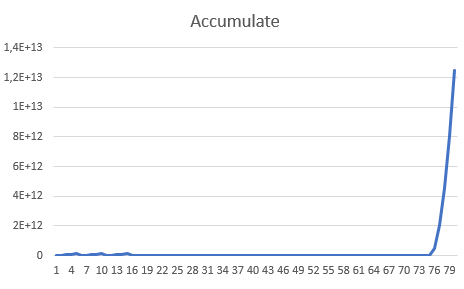

```{r}

##TEMPO TODOS VALORES X MEMORIA GASTA


barplot(table(teste$time_elapsed,teste$memory ),
        main = "tempo de execusão",
        ylab = "tempo",
        xlab = "memoria",
        col = 'red'
        )

```
```{r}

## Acumulate


plot(teste$accumulate, col = 'blue')



```

```{r}

## % DE MEMORIA MAIS UTILIZADA

pie(table(teste$memory))
boxplot(teste$memory, col = 'blue')

```


```{r}


## RANGES 


plot(table(rangeA$time_elapsed,rangeA$memory ),
        main = "tempo de execusão",
        ylab = "tempo",
        xlab = "memoria",
        col = 'red'
        )

```